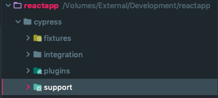

# E2E Testing

## 1. Einleitung

### 1.1 Testverfahren im Vergleich

Es gibt unzählige Arten von Testverfahren. Viele machen generell ähnliche Dinge bzw. beschreiben faktisch die gleichen Testmethoden (z.B. Funktionentests, E2E-Tests, Browsertests, GUI-Tests, Akzeptanztest, Systemtests, etc.). Nachfolgend Testmethoden aus den [Softwaretests](https://de.wikipedia.org/wiki/Softwaretest), mit welchen man sich auseinandersetzen könnte (natürlich nur ein "Auszug"):

#### 1.1.1 Funktionentests (funktionale Anforderungen)

* [Akzeptanztest](https://de.wikipedia.org/wiki/Akzeptanztest_(Softwaretechnik)) oder auch _UAT_
* [API Tests](https://en.wikipedia.org/wiki/API_testing) oder auch _API testing_
* [Integrationstest](https://de.wikipedia.org/wiki/Integrationstest) oder auch _integration testing_
* Interface Testing
* [Modultests](https://de.wikipedia.org/wiki/Modultest) oder auch _unit testing_
* [Rauchtest](https://de.wikipedia.org/wiki/Smoke_testing) oder auch _smoke testing_
* [Regression Testing](https://de.wikipedia.org/wiki/Regressionstest) oder auch _regression testing_
* [Sanity testing](https://de.wikipedia.org/wiki/Sanity_Check)
* [Systemtests](https://en.wikipedia.org/wiki/System_testing) oder auch system testing

#### 1.1.2 [Nichtfunktionale Tests](https://en.wikipedia.org/wiki/Non-functional_testing) (Funktionsweise eines Systems)

Die Namen vieler nicht funktionaler Tests werden häufig austauschbar verwendet und überlappen oft stark.

* [A/B Tests](https://en.wikipedia.org/wiki/A/B_testing)
* Availability testing
* Baseline testing
* Compatibility testing
* Compliance testing
* Configuration testing
* [Conformance testing](https://en.wikipedia.org/wiki/Conformance_testing)
* [Documentation testing](https://en.wikipedia.org/wiki/Documentation_testing)
* [Endurance testing](https://en.wikipedia.org/wiki/Soak_testing) oder auch _soak testing_
* Ergonomics testing
* Interoperability testing
* Installation testing
* [Lasttest](https://de.wikipedia.org/wiki/Lasttest_(Computer)) oder auch _load testing_
* Localization testing and Internationalization testing
* Maintainability testing
* Operational readiness testing
* [Penetrationstest](https://de.wikipedia.org/wiki/Penetrationstest_(Informatik)) oder auch _pentest_
* [Performance testing](https://en.wikipedia.org/wiki/Software_performance_testing)
* Recovery testing
* Reliability testing
* Resilience testing
* [Security testing](https://en.wikipedia.org/wiki/Security_testing)
* [Scalability testing](https://en.wikipedia.org/wiki/Scalability_testing)
* [Stresstest](https://de.wikipedia.org/wiki/Stresstest) oder auch _stress testing_
* [Usability-Test](https://de.wikipedia.org/wiki/Usability-Test) oder auch _usability testing_
* [Volume testing](https://en.wikipedia.org/wiki/Volume_testing)

### 1.2. Konzentration auf das Wesentliche

Oftmals ist es nicht notwendig (vor allem in der [Webentwicklung](https://de.wikipedia.org/wiki/Webentwicklung)) sich auf alle Testverfahren zu konzentrieren (Konzentriere dich nur auf die Wichtigsten!). Viele nicht-funktionale Tests werdem durch Admins ausgeführt, der Rest sind Tests für Spezialisten:

| | Unit-Tests | Integration-Tests | Funktionstests (Akzeptanztest) |
|---|---|---|---|
| Kurzbeschreibung | Prüft kleine Code-Teile wie zum Beispiel individuelle Funktionen auf einen Erwartungswert bei gegebenen Eingaben. | Prüft Unit-Tests in Systemumgebungen bzw. in Abhängigkeiten auf dem auszuführendem Systems (Datenbank, Dateisystem, Netzwerk, anderen Unit-Tests, etc.). | Prüft, ob eine Software aus Sicht des Benutzers wie beabsichtigt funktioniert. |
| Eigenschaften | - unabhängig vom System (DB, Dateisystem, Netzwerk, etc.) - meist auf Funktionsebene - Definition Eingang und erwarteter Ausgang | Integration Tests helfen dabei, zu überprüfen, ob und wie verschiedene Teile einer Anwendung mit dem System zusammenarbeiten (DB, Dateisystem, Netzwerk, andere Module, etc.) | - Automatisierte Browsersimulation - Überprüfen von User-Aktionen - Einbeziehen von Umgebungseigenschaften (Ausführen von Javascript, etc.) - Durch Realisierung von User-Aktionen, Ausführung teilweise lang: Sparsames Einsetzen! - Login, Warenkorb, Formulare, etc. - Sofern möglich: Auf Unit- oder Integration-Tests setzen |
| Entwicklungsebene | Auf Code-Ebene (Programmiersprachenabhängig) | In den meisten Fällen ebenfalls auf Code-Ebene (Programmiersprachenabhängig) | Auf GUI Ebene (unabhängig von der Entwicklungsumgebung und Sprache) |
| Geschrieben von | Entwicklern | Entwicklern | Entwicklern, Usern (Kunden), Administratoren |
| Verwendet von | Entwicklern | Entwicklern | Usern, Kunden |

Nachfolgend und beziehend auf das Thema dieses Tutorials ein Einstieg nur auf die Tests, welche die größte Schnittmenge zwischen Usern (Kunden) und Entwicklern abdeckt: den Akzeptanztests respektive den E2E-Tests. Akzeptanztest erhöhen das Vertrauen in der Verwendung der Software zwischen Usern (Kunden) und den Entwicklern.

### 1.3 Wichtig!

* Akzeptanztest sparsam einsetzen, da diese bedingt durch die Simulation von User-Aktionen eine gewisse Performance vorraussetzen
* Wenn möglich, dann eher detailierte Prüfungen durch Unit- und Integrationstests abdecken!
  * Lade Datensatz xy (Eingaben) und erwarte Inhalt yz
* Nur die entscheidenden (geschäftskritische) Funktionen testen, z.B.:
  * Loginfunktion
  * Warenkorbfunktion
  * Bestellprozess
  * Formularfunktionen
  * eher nicht: jede einzelne Seite auf Inhalte überprüfen (mögliche Änderungen am Inhalt brechen den Test)

### 1.4 Vorraussetzungen, Anforderungen

* visuelle Darstellung der Tests (aus Usersicht)
* Kommandozeilenorientiert: automatische Tests vor dem Deployment (aus Administratorsicht)

### 1.5 Akzeptanztests und deren Frameworks sind...

* unabhängig von der zu testenden Anwendung
* unabhängig von der Programmiersprache der zu testenden Anwendung
* unabhängig von den Entwicklungsfortschritten
* werden parallel zu den oben aufgeführten Schritten durchgeführt
* können von einer "Drittperson" durchgeführt werden

## 2. Übersicht

### 2.1 E2E Testing Frameworks

* [Selenium WebDriver](https://www.seleniumhq.org/projects/webdriver)
  * benötigt Kenntnisse in der Programmiersprache "Java"
  * ist ein Framework für [QA](https://de.wikipedia.org/wiki/Qualit%C3%A4tssicherung)-Entwickler
  * erfordert eine komplexe Umgebung (besitzt ein "Framework Architecture Design")
    * http://seleniummaster.com/sitecontent/images/Selenium%20Webdriver%20FrameworkDirectoryStructure.png
    * http://4.bp.blogspot.com/-kJV67jnJ3MQ/U4uJfHVdIAI/AAAAAAAAARg/9eIgRHfCjCI/s1600/IMAG1218.jpg
* [Cypress](https://www.cypress.io)
  * benötigt Kenntnisse in der Programmiersprache "Javascript"
  * ist ein Framework für (Frontend-)Entwickler
  * 4 Ordner
    * 
  * `user$ npm install cypress`
* etc.

## 3. Best Practices

Nachfolgende genannte bewährte Verfahren beziehen sich auf alle funktionalen Testverfahren (Akzeptanztest) und sind Framework- und Tool-unabhängig. Genannte Codebeispiele beziehen sich auf auf das Cypress Framework.

### 3.1 Login

* Logge dich nicht über die GUI ein (langsam und durchaus fehleranfällig)
* Logge dich programmgesteuert in deine Anwendung ein
  * übernimm die Kontrolle deiner Anwendung: Setze den Login-Status direkt beim Testen
* Einzige Ausnahme: Du testest den Login-Prozess direkt

### 3.2 Verwenden von Selektoren

* Verwende keine Design-gebundenen Selektoren (CSS, classes, Tags, etc.)
  * diese können sich ändern und brechen damit den Test
* Verwende Design-ungebundene Selektoren (data Attribute, Text, etc.)
  * Diese werden nur für das Testing verwendet
  * Text-Tests sind wichtig, wenn der Test abhängig vom Text ist (Speichern vs. Abbrechen)

Beispiel:

`<button id="main-button" class="btn btn-save" data-cy="save">Save</button>`

* Niemals (*kein Kontext*): `cy.get('button').click()`
* Auch nicht (*kann sich bei Designänderungen ändern*): `cy.get('.btn.btn-save').click()`
* Besser (*nicht eindeutig ersichtlich, dass diese ID zum testen verwendet wird*): `cy.get('#main-button').click()`
* OK (*nur wenn Textänderungen den Test brechen sollen*): `cy.contains('Save').click()`
  * z.B. Text ändert sich von "Save" zu "Cancel"
* Optimal (*eindeutig ersichtlich, dass dieses Attribut zum Testen verwendet wird*): `cy.get('[data-cy=save]').click()`

### 3.3 Besuch von externen Quellen (Seiten, APIs, etc.)

* Interagiere mit keinen Websites oder Servern, die du nicht selbst kontrollierst
* Besser: verwende gar keine externen Quellen
* Teste nur, was Du auch kontrollieren kannst
* Versuche zu vermeiden, dass du einen Server eines Drittanbieters benötigst

Eventuelle Ausnahmen:

* Testen einer Anmeldung, welche einen anderen Anbieter nutzt
* Datenänderungen zu einem Dritt-Dienst müssen überprüft werden
* Testen der "Passwort vergessen" Funktion
* etc.

Hintergrund:

* Testen von Drittdiensten ist unglaublich zeitaufwendig und verlangsamt Deine Tests
* Die Website von Drittanbietern kann ihren Inhalt ändern oder aktualisieren (außerhalb deiner Kontrolle)
* Externe Quellen können Probleme haben (500er Fehler, etc.)
* Der Drittanbieter kann erkennen, dass du über ein Skript testest und Dich blockieren
* Die Drittanbieter-Website kann AB-Kampagnen durchführen (Unterschiedliche Erwartungswerte)
* Externe Quellen benötigen eine Internet Verbindung (eine fehlende Verbindung bricht den Test)

Tipps und Tricks für den Login-Prozess:

* Lokaler "Fake-Login": Erwartete Login-Rückgabewert kommt aus deiner Anwendung selbst und wird nicht an den Drittdienst gesendet (wenn möglich)
* Wenn Du einen echten Token benötigst, kann dieser unter Umständen auch anders als über den Login erhalten werden (via API, fester Programmier-Token, etc.)
* etc.

### 3.4 Testabhängigkeiten

* Vermeide die Durchführung von Tests, welche auf dem Stand früherer Tests basieren
* Tests sollten immer unabhängig voneinander ausgeführt werden können und trotzdem erfolgreich sein
* Lagere geteilten Testcode aus, welcher von verschiedenen Tests benötigt wird (Initialisierungen von Formularen, etc.)

### 3.5 Komplexität von Tests

* Einzelne Tests sollten nicht zu komplex, aber auch nicht zu einfach sein
* Ein einzelner Test welcher die Webseite komplett testet ist genauso ineffektiv, wie viele Test, welche sich nur auf einen einzelnen Punkt konzentrieren (Seitenelement enthält den Wert xy, etc.)
* Fasse sinnvolle Test-Elemente zu einem einzelnen Test zusammen
* Zuviele Tests mit nur einem einzelnen Testelement sind nicht performant
* Zu komplexe Tests schwierig zu warten

### 3.6 Unnötiges Warten

* Vermeide zeitabhängige Tests (z.B. bis Element auf Seite zu sehen ist)
* Meist gibt es einen einacheren Weg solche Dinge zu testen (eventuell sind sie gar nicht notwendig oder sogar falsch)

Beispiele:

Todo..

### 3.7 Web Server

* Webserver (oder andere notwendige Dienste) sollten nicht innerhalb von Tests erst gestartet werden müssen
* Besser: Die benötigten Dienste sind schon vor dem Teststart vorhanden (andernfalls wird der Test gar nicht erst gestartet)
* Gestartete Dienste innerhalb des Tests belegen unnötig Ressourcen
* Die Unabhängigkeit von Tests ist durchaus nicht gewährleistet (oder jeder Test müsste seinen eigenen Dienst starten)
* Parallele Tests sind nicht möglich (Eventuelle Portkonflikte, etc.)

### 3.8 Verwenden von URLs

* Vermeide die Verwendung von festen kompletten Adressen wie `https://www.address.com/login`
* Verwende relative Adressen wie `/login`
* Tests auf unterschiedlichen Umgebungen wird damit ermöglicht (Browser, Kommandozeile, etc.)
* Verwende die allgemeine, umgebungsbasierte Konfiguration deines Frameworks um eine BaseURL zu hinterlegen
* Tests sollten unabhängig der verwendeten URL sein (`http://localhost`, `https://www.address.com`, etc.)
* Unabhängig von z.B. verwendeten Ports (`http://localhost`, `http://localhost:8080`, etc.)

## 4. Best Practices (Cypress)

### 4.1 Zuweisen von Rückgabewerten

Todo..

### 4.2 Verwendung von "after" oder "afterEach" Hooks

Todo..

## A. Weitere Anleitungen

* Todo..

## B. Quellen

* [Best practices - Cypress](https://docs.cypress.io/guides/references/best-practices.html)
* [A glimpse into the test jungle (German)](https://entwickler.de/online/durchblick-im-test-dschungel-unterschiede-zwischen-unit-integration-und-funktionstesting-149903.html)
* [Functional Testing Vs Non-Functional Testing](https://www.softwaretestingclass.com/functional-testing-vs-non-functional-testing)
* [Unit tests vs Functional tests](https://stackoverflow.com/questions/2741832/unit-tests-vs-functional-tests)

## C. Tools

* Todo..

## D. Fußnoten

* 1 = ..

## E. Autoren

* Björn Hempel <bjoern@hempel.li> - _Erste Arbeiten_ - [https://github.com/bjoern-hempel](https://github.com/bjoern-hempel)

## F. Lizenz

Dieses Tutorial steht unter der MIT-Lizenz - siehe die Datei [LICENSE.md](/LICENSE.md) für weitere Informationen.
